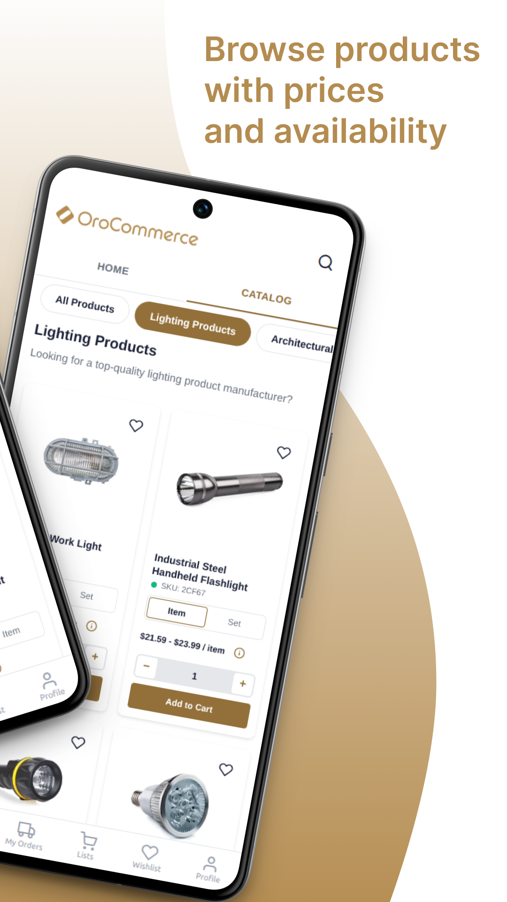
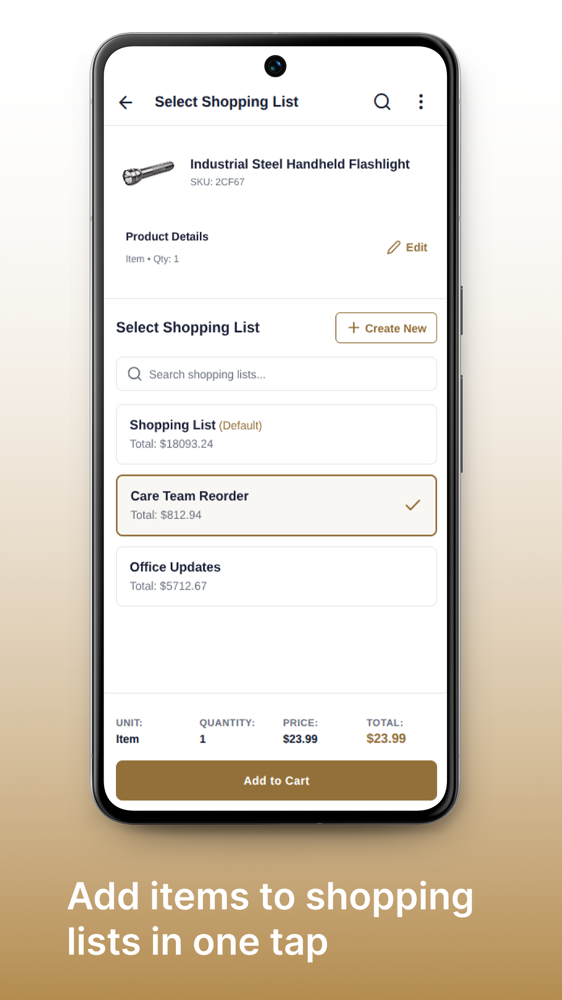
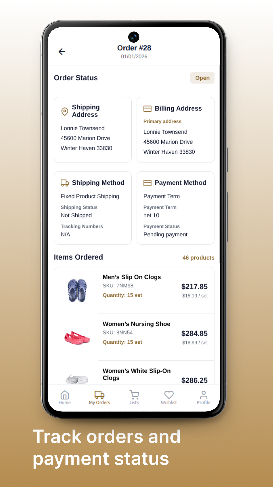

# OroCommerce Mobile Storefront App

A React Native mobile application for OroCommerce B2B e-commerce platform, built with Expo.

[](https://play.google.com/store/apps/details?id=com.rkukla.orocommerceapp)
[](https://www.youtube.com/watch?v=jvExANt-Q9E)

## Screenshots

<p style="text-align: center;">
  
  
  
  
</p>

## Table of Contents

- [Quick Start](#quick-start)
- [OroCommerce Configuration](#orocommerce-configuration)
- [App Configuration](#app-configuration)
- [Running the App](#running-the-app)
- [Testing](#testing)
- [Deployment](#deployment)
- [Features](#features)
- [License](#license)

## Quick Start

### Prerequisites

- Node.js 18+ and npm
- OroCommerce instance (5.1 or higher)
- Expo account (for deployment)

### Installation

1. **Clone the repository:**
   ```bash
   git clone git@github.com:poman/orocommerce-react-native-app.git
   cd orocommerce-react-native-app
   ```

2. **Install dependencies:**
   ```bash
   npm install
   ```

3. **Configure the app:**
   
   Copy the example configuration:
   ```bash
   cp app.json.example app.json
   ```
   
   Then update `app.json` with your settings (see [App Configuration](#app-configuration))

4. **Start the development server:**
   ```bash
   npx expo start -c
   ```

5. **Run on your device:**
   - Scan the QR code with Expo Go app (iOS/Android)
   - Press `a` for Android emulator
   - Press `i` for iOS simulator (macOS only)
   - Press `w` for web browser
   
   By default, the web app will be available at **http://localhost:8081/**

## OroCommerce Configuration

### 1. Enable Guest Storefront API

In OroCommerce Admin Panel:

1. Navigate to **System → Configuration → Commerce → Guests → Website Access**
2. Enable **"Enable Guest Storefront API"**
3. Click **"Save Settings"**

### 2. Configure CORS Settings

Update your OroCommerce `config/config.yml`:

```yaml
oro_frontend:
  routes_to_expose: ['oro_.*']
  frontend_api:
    cors:
      preflight_max_age: 600
      allow_origins: ['*']  # Change to your domain in production
      allow_credentials: true
      allow_headers:
        - 'Content-Type'
        - 'Accept'
        - 'Authorization'
        - 'X-Addon'
        - 'X-CSRF-Header'
      expose_headers:
        - 'Content-Type'
        - 'X-Include'
        - 'X-CSRF-Header'

oro_oauth2_server:
  authorization_server:
    cors:
      allow_origins: ['*']  # Change to your domain in production
```

**Important:** For production, replace `'*'` with your specific domain(s).

After updating, clear the cache:

```bash
php bin/console cache:clear
```

### 3. Create OAuth Application

1. In OroCommerce Admin Panel, navigate to **System → Customers → Customer User OAuth Applications**
2. Click **"Create OAuth Application"**
3. Fill in:
   - **Name:** Your app name (e.g., "Mobile App")
   - **Grant Type:** Select **"password"**
   - **Active:** Check the box
4. Click **"Save"**
5. **Copy the generated Client ID and Client Secret** - you'll need these for app.json

## App Configuration

### Update app.json

After copying `app.json.example` to `app.json`, update these key sections:

#### 1. Basic App Information

```json
{
  "expo": {
    "name": "Your App Name",
    "slug": "your-app-slug",
    "version": "1.0.0"
  }
}
```

#### 2. iOS Configuration

```json
{
  "expo": {
    "ios": {
      "supportsTablet": true,
      "bundleIdentifier": "com.yourcompany.yourapp"
    }
  }
}
```

**⚠️ Important:** Change `com.yourcompany.yourapp` to your unique bundle identifier (e.g., `com.acme.storefrontapp`)

#### 3. Android Configuration

```json
{
  "expo": {
    "android": {
      "versionCode": 1,
      "package": "com.yourcompany.yourapp",
      "adaptiveIcon": {
        "backgroundColor": "#FFFFFF",
        "foregroundImage": "./assets/icon.png"
      }
    }
  }
}
```

**⚠️ Important:** Change `com.yourcompany.yourapp` to your unique package name

#### 4. OroCommerce API Configuration

```json
{
  "expo": {
    "extra": {
      "eas": {
        "projectId": "YOUR_EAS_PROJECT_ID"
      },
      "EXPO_PUBLIC_API_BASE_URL": "https://your-orocommerce.com/",
      "EXPO_PUBLIC_OAUTH_CLIENT_ID": "your_client_id_from_step_3",
      "EXPO_PUBLIC_OAUTH_CLIENT_SECRET": "your_client_secret_from_step_3"
    }
  }
}
```

**Update these values:**
- `projectId`: Your EAS Project ID
  - If you haven't set up EAS yet, run `eas build:configure` (see [deployment.md](./deployment.md))
  - This command will generate a unique Project ID and add it to your `app.json`
  - The Project ID links your app to your Expo account for builds
- `EXPO_PUBLIC_API_BASE_URL`: Your OroCommerce instance URL
- `EXPO_PUBLIC_OAUTH_CLIENT_ID`: From OAuth Application (Step 3)
- `EXPO_PUBLIC_OAUTH_CLIENT_SECRET`: From OAuth Application (Step 3)

**Note:** You can run the app locally without the EAS Project ID, but you'll need it for cloud builds with `eas build`.

## Running the App

### Development Mode

```bash
# Start with cache clear
npx expo start -c

# Run on specific platform
npx expo start --android
npx expo start --ios
npx expo start --web
```

When you start the development server:
- The Expo DevTools will open in your browser
- For web development, the app runs at **http://localhost:8081/** by default
- Scan the QR code with Expo Go app to run on physical devices
- Use platform shortcuts (`a`, `i`, `w`) for emulators/simulators

### Demo Mode vs Production Mode

The app supports two modes configured in `src/constants/config.ts`:

**Demo Mode (default):**
- Shows test login button with demo credentials
- Settings page visible in Profile
- Configuration wizard appears on errors
- Perfect for testing and development

**Production Mode:**
- Test login hidden
- Settings page hidden
- Configuration wizard hidden
- Perfect for released app with fixed OroCommerce instance

To switch modes, edit `src/constants/config.ts`:

```typescript
export const AppConfig = {
  mode: 'production', // Change to 'production' for release
  // ...
};
```

## Testing

The app includes comprehensive test coverage:

### Unit Tests

Test individual functions and utilities:

```bash
npm test                    # Run all tests
npm run test:watch          # Watch mode
npm run test:coverage       # With coverage report
```

### Integration Tests

Test service interactions and API calls:

```bash
npm test tests/integration  # Run integration tests
```

### End-to-End Tests

Test complete user workflows with Playwright:

```bash
# First time: Install Playwright browsers
npx playwright install

# Run E2E tests
npm run test:e2e            # Headless mode
npm run test:e2e:ui         # Interactive UI mode
npm run test:e2e:headed     # See browser
npm run test:e2e:report     # View test report
```

### Run All Tests

```bash
npm run test:all            # Run all test types
```

## Deployment

For detailed deployment instructions see **[deployment.md](./deployment.md)**

## Features

### Shopping & Products
- Browse OroCommerce product catalog
- View product details with images, SKU, price, and inventory
- Manage shopping lists
- Add products to cart
- Wishlist functionality
- Recently viewed products

### Authentication
- Guest browsing (no login required)
- OAuth 2.0 user authentication
- Automatic token refresh
- Secure session management

### Checkout
- Multi-step checkout process
- Address management
- Shipping method selection
- Payment method selection
- Order confirmation

### User Features
- Order history
- Profile management
- My Conversations (support tickets)
- Settings (in demo mode)

### UI/UX
- Responsive design (360px - 1200px)
- Tab navigation
- Pull-to-refresh
- Skeleton loading states

## License

MIT License - See [LICENSE](./LICENSE) for details.

